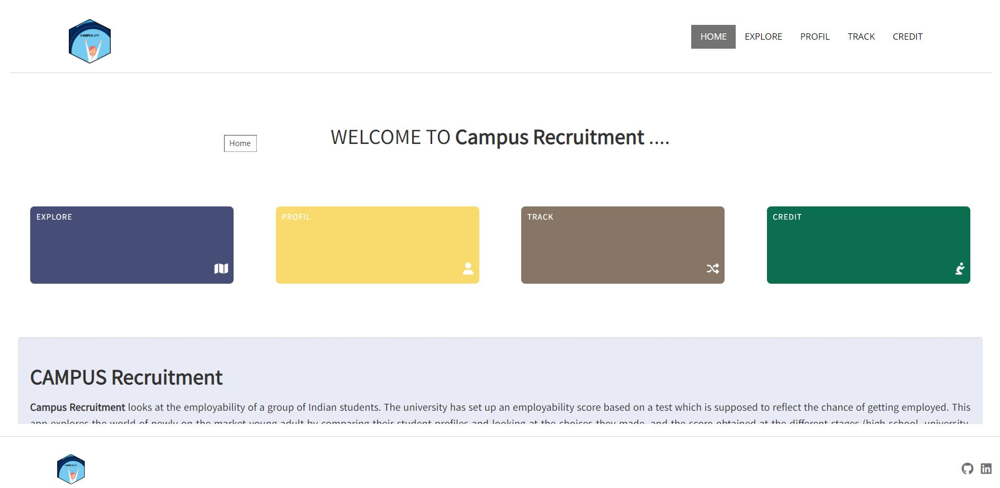

## Campus recruitment

An application to explore the 

**Packages** : The application use the following packages : [`shiny`](https://shiny.rstudio.com/), [`golem`](https://github.com/ThinkR-open/golem), [`plotly`](https://plotly.com/r/), [`ggplot2`](https://ggplot2.tidyverse.org/), 
[`shinyjs`](https://deanattali.com/shinyjs/). To see which versions of these packages are used (and dependancies), look at the file `DESCRIPTION` file in app directory.

**Data sources** : Campus Recruitment are from [kaggle.com/datasets](https://www.kaggle.com/datasets/benroshan/factors-affecting-campus-placement).

Launch application : 

[`https://ghee.shinyapps.io/campusrecruitment/`](https://ghee.shinyapps.io/campusrecruitment/)

